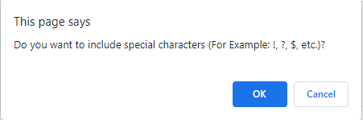

# **JavaScript Password Generator**

The objective of this project is to create a secure password generator using JavaScript. The password can be between 8 and 128 characters in length and allows for the usage of uppercase letters, lowercase letters, numbers, and special characters.

## Getting Started

After opening the page the user can begin generating their password by clicking on the red "Generate Password" button. Here is a screenshot of the full site for reference:

##Choosing the Length of Your Password

The first prompt will ask you how many characters in length you'd like your password to be. Lengths between 8 and 128 characters are valid:

**NOTE:** If a value lesser than 8 characters or greater than 128 is chosen, the user will view an alert that advises them to select an appropriate length. They will need to restart the process by selecting the "Generate Password" button:

**NOTE:** If the user enters characters that are not numbers, then an alert will suggest that they enter the appropriate characters. They will need to restart the process by selecting the "Generate Password" button:

## Confirming Character Types

The following 4 prompts will ask the user to confirm which types of characters that they would like included in their password.

The first will ask them if they would like to include uppercase letters:

Followed by lowercase letters:

Then numbers:

And lastly, special characters:

**NOTE:** If none of the preceding categories are chosen, the user will see an alert that tells them to choose at least one character type. They will need to restart the process by selecting the "Generate Password" button.

## Password Generated

After navigating these steps, you password will be generated and displayed in a window alert:

### Try it Yourself

[You can generate your own password by clicking this link!](https://littmarque27.github.io/javascript-powered-password-generator/)
 